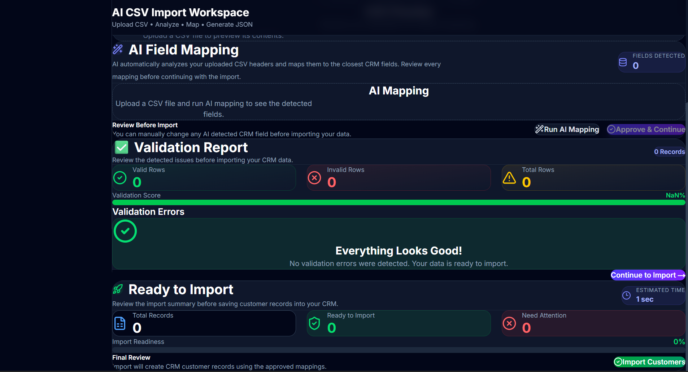
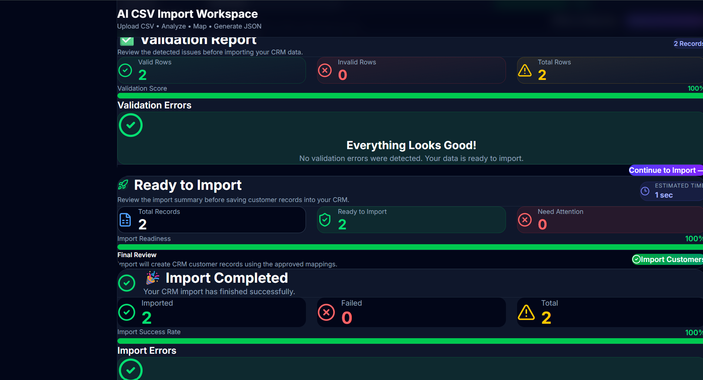
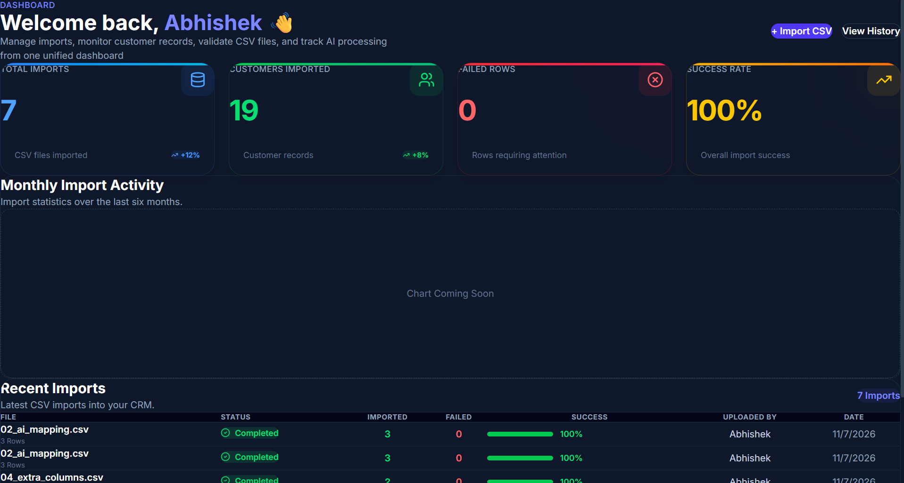
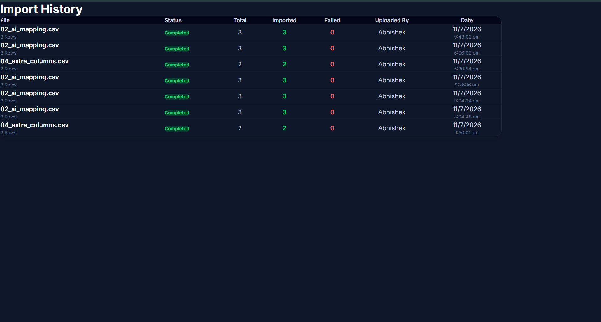
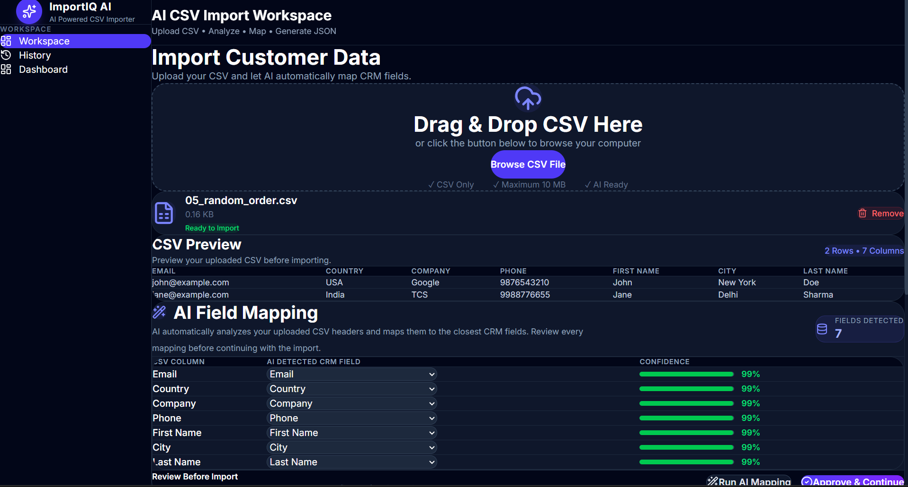

# ImportIQ AI -- AI Powered CSV Importer

## Overview

ImportIQ AI is an AI-powered CSV Importer built for the GrowEasy
assignment.

## Live Demo

-   Frontend: `<YOUR_VERCEL_URL>`{=html}
-   Backend: `<YOUR_RENDER_URL>`{=html}

## GitHub

https://github.com/AbhishekJaiswal05/groweasy-ai-csv-importer

## Tech Stack

-   Next.js
-   React
-   Tailwind CSS
-   Node.js
-   Express.js
-   MongoDB
-   Gemini AI

## Features

-   CSV Upload
-   Drag & Drop
-   CSV Preview
-   AI Field Mapping
-   Validation Report
-   Import Dashboard
-   Import History

## Setup

### Backend

``` bash
cd server
npm install
npm run dev
```

### Frontend

``` bash
cd client
npm install
npm run dev
```

## Environment Variables

Server:

``` env
PORT=5000
MONGO_URI=your_uri
GEMINI_API_KEY=your_key
```

Client:

``` env
NEXT_PUBLIC_API_URL=http://localhost:5000
```

## Screenshots

### Workspace


### Preview & AI Mapping



### Validation



### Dashboard



### History



### Import Completed



## Author

Abhishek Jaiswal
